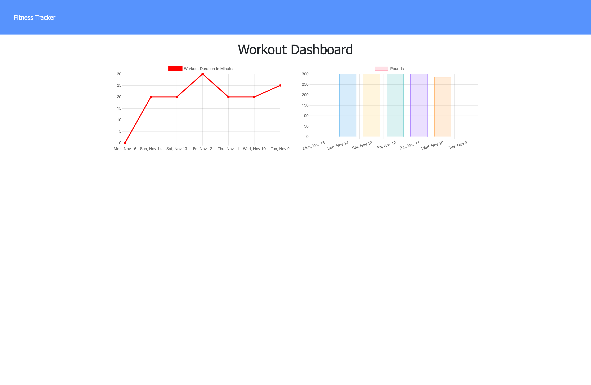

# NoSQL-workout-tracker

## Link to deployed app:
https://workout-sl.herokuapp.com/

## Description
- This fullstack node application creates a Mongo database with a Mongoose schema and handles routes with Express. Built using node js, below-mentioned npm's, and bootstrap.
- As a user of the application, I want to be able to view create and track daily workouts. I want to be able to log multiple exercises in a workout on a given day. I should also be able to track the name, type, weight, sets, reps, and duration of exercise. If the exercise is a cardio exercise, I should be able to track my distance traveled. 

## NPM's
Packages needed to run components of this application: express and mongoose.
- [Express](https://www.npmjs.com/package/express)
- [Mongoose](https://www.npmjs.com/package/mongoose)

## Usage 
A web application that dynamically interacts with a database, to allow users reach fitness goals more quickly because they are able to track workout progress.

## Collaboration
- Ethan Cho: helped in writing aggregate functions. 

## License
